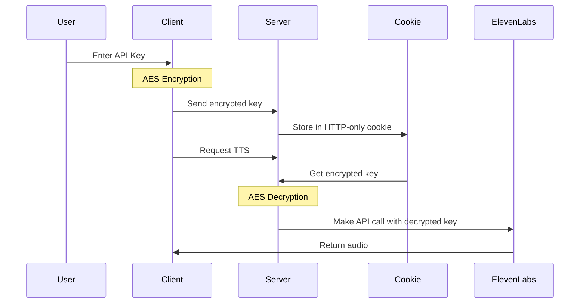

# ScriptLab - Secure SSML Editor for ElevenLabs

ScriptLab is an open-source SSML (Speech Synthesis Markup Language) editor designed specifically for ElevenLabs' text-to-speech API. It provides a secure, user-friendly interface for creating and testing SSML-enhanced voice content.

## Security Architecture

Our API key handling system ensures your ElevenLabs API key remains protected through encryption:



### How it Works

1. **When you enter your API key:**
   - Your API key is immediately encrypted using AES encrtbsmhption in the browser
   - Only the encrypted version is sent to our server
   - The encrypted key is stored in an HTTP-only cookie (inaccessible to JavaScript)

2. **When making API calls:**
   - Our server retrieves the encrypted key from the cookie
   - Decrypts it securely on the server side
   - Uses it to authenticate with ElevenLabs
   - The original API key is never stored or exposed

## Features

- Real-time SSML validation
- Break tag customization
- Emphasis controls
- Secure API key handling
- Dark/Light theme support

## Setup

1. Clone the repository
```bash
git clone https://github.com/Skrptforge/ssml-editor.git
cd ssml-editor
```

2. Install dependencies
```bash
npm install
```

3. Create a `.env.local` file:
```env
NEXT_PUBLIC_ENCRYPTION_KEY=your_secure_key_here
```

4. Run the development server
```bash
npm run dev
```

## Tech Stack

- Next.js 14
- TypeScript
- Tailwind CSS
- Shadcn UI
- CryptoJS for encryption
- Axios for API calls

## Contributing

Pull requests are welcome! Check out our [issues](https://github.com/Skrptforge/ssml-editor/issues) for ways to contribute.

## License

MIT License - see [LICENSE](LICENSE) for details.

Notion-style script editor with per-line play, SSML editing toolbar and ElevenLabs integration.

## Quick start

1. Create a Next.js app (App Router) with TypeScript + Tailwind:

```bash
npx create-next-app@latest scriptlab --typescript --tailwind
cd scriptlab
```

2. Install dependencies

```bash
npm install lucide-react zustand uuid
# Optional: shadcn
npx shadcn-ui@latest init
npx shadcn-ui@latest add button textarea
```

3. Copy the files from this doc into your project.

4. Add environment variables to `.env.local`:

```
NEXT_PUBLIC_USE_ELEVEN=1
ELEVENLABS_API_KEY=your_server_side_elevenlabs_key
ELEVENLABS_VOICE_ID=voice_id
```

5. Run dev server

```bash
npm run dev
```

Open http://localhost:3000


## Notes
- The ElevenLabs API key must stay server-side (do NOT expose it to the browser).
- This scaffold returns audio as a data URL for convenience. For production, upload audio to S3/GCS and return a CDN URL.
```
```
